##LW2🌱 Plant Species Image Classification
### Using Google Teachable Machine

---

## A. Project Overview

This project is an image classification model trained to recognize **20 different legume/bean plant species** using **Google Teachable Machine**. The model was built as part of Laboratory Work 2-A, which involves organizing a labeled image dataset, training a machine learning model, evaluating its performance, and documenting the results.

The purpose of this model is to automatically identify and classify legume species based on input images — including photos of seeds, pods, leaves, flowers, and whole plants. This has practical applications in agriculture, food science, and botanical research, where quick and accurate species identification is important.

---

## B. Plant Species

Below are the 20 legume plant species used in this project, each with a representative image, common name, scientific name, and description.

---

### 1. Adzuki Beans
**Scientific name:** *Vigna angularis*
Small, red-colored beans commonly used in East Asian cuisines, particularly in sweet pastes and desserts. The plant grows as a bushy annual with yellow flowers.

> 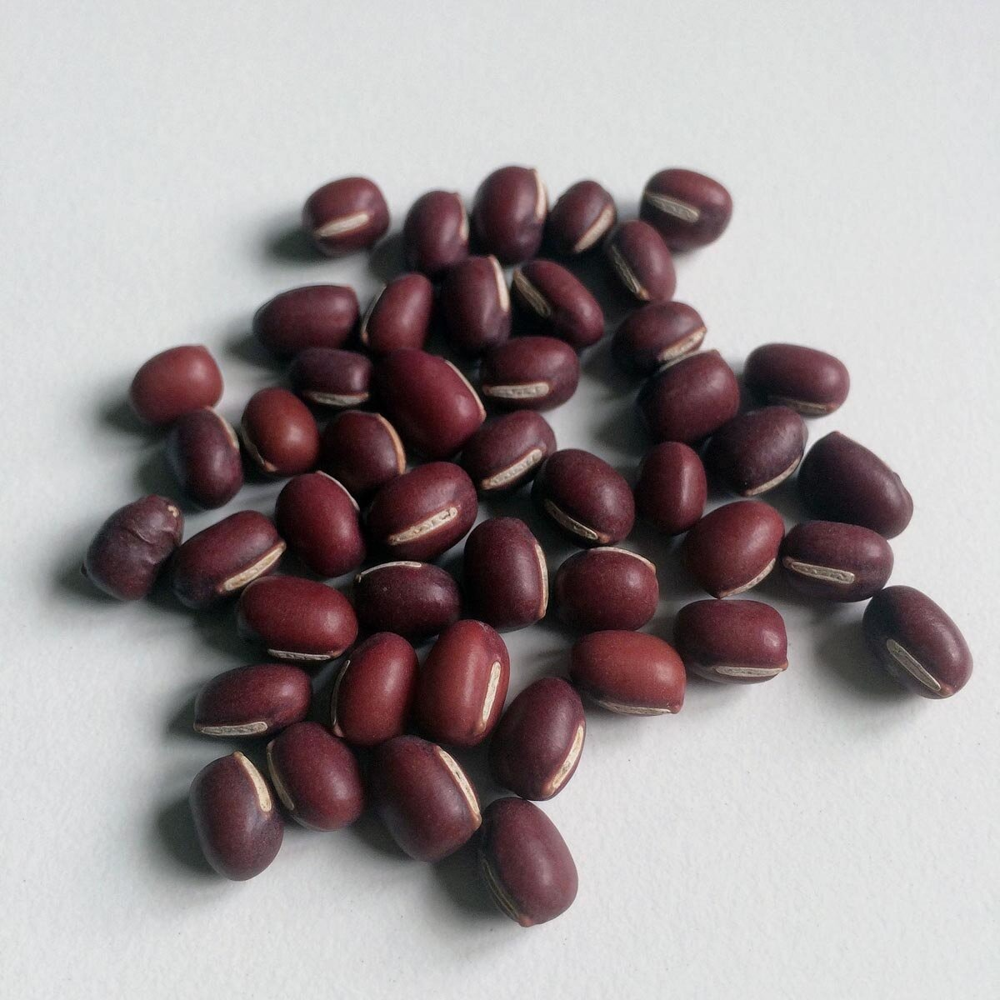

---

### 2. Bambara Groundnuts
**Scientific name:** *Vigna subterranea*
A legume native to West Africa that produces pods underground, similar to peanuts. The seeds are round and come in various colors. It is drought-resistant and nutritionally rich.

> 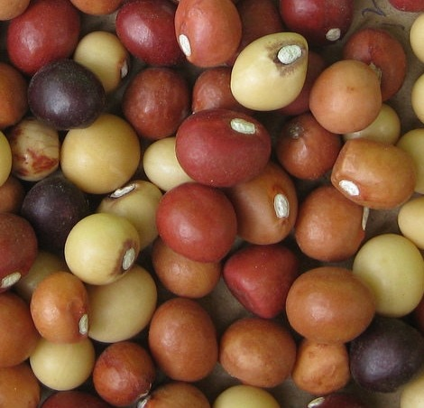

---

### 3. Black Beans
**Scientific name:** *Phaseolus vulgaris*
Shiny black-coated beans widely used in Latin American and Caribbean cuisines. The plant grows as a bushy or climbing vine and produces pods containing 4–6 seeds.

> 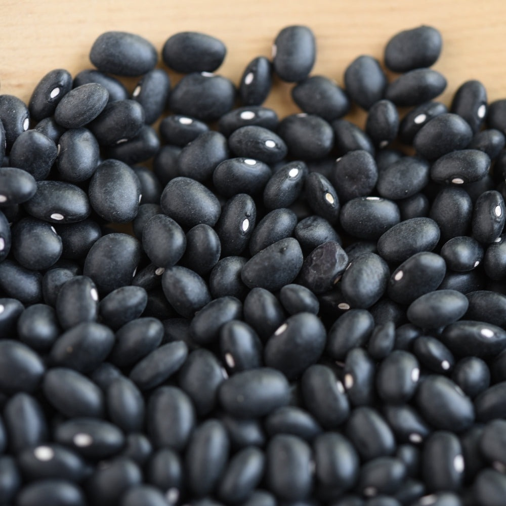

---

### 4. Black-eyed Peas
**Scientific name:** *Vigna unguiculata*
Cream-colored beans with a distinctive black spot around the hilum. They are a staple food in Africa, the Southern United States, and parts of Asia. The plant is heat- and drought-tolerant.

> 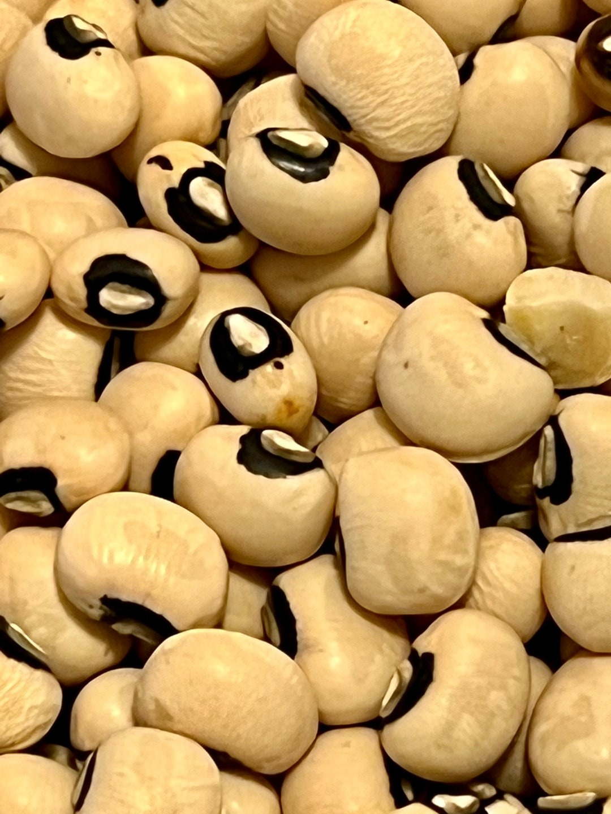

---

### 5. Chickpeas (Garbanzo)
**Scientific name:** *Cicer arietinum*
Round, beige-colored legumes that are one of the earliest cultivated crops. Used widely in Middle Eastern, South Asian, and Mediterranean dishes. The plant is a cool-season annual.

> 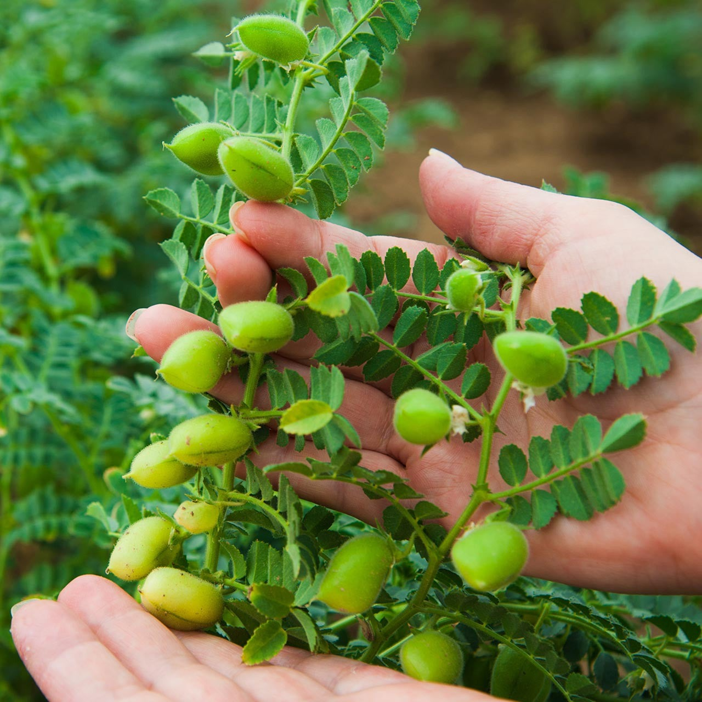

---

### 6. Cowpeas (Vigna)
**Scientific name:** *Vigna unguiculata subsp. unguiculata*
A warm-season legume cultivated throughout Africa and Asia. Cowpeas produce long pods and seeds of varying colors. They are highly nutritious and important in subsistence farming.

> 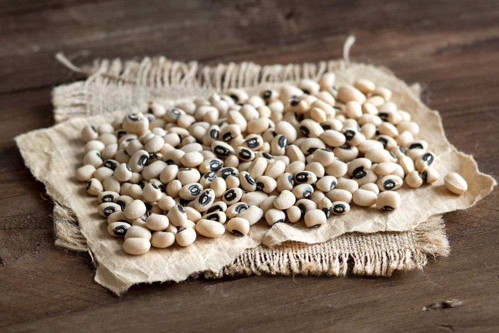

---

### 7. Fava Beans
**Scientific name:** *Vicia faba*
Large, flat green beans enclosed in thick, fleshy pods. One of the oldest crops in human history, commonly grown in Europe, the Middle East, and North Africa. The plant grows tall with white and black flowers.

> 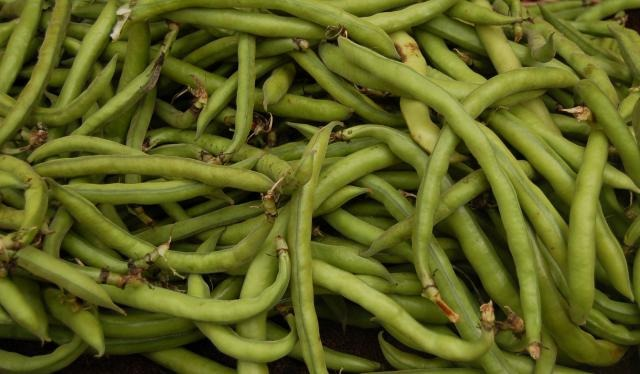

---

### 8. Green Peas
**Scientific name:** *Pisum sativum*
Spherical green seeds enclosed in smooth pods, widely cultivated worldwide. A cool-season crop commonly consumed fresh, frozen, or dried. The plant is a climbing vine with white flowers.

> 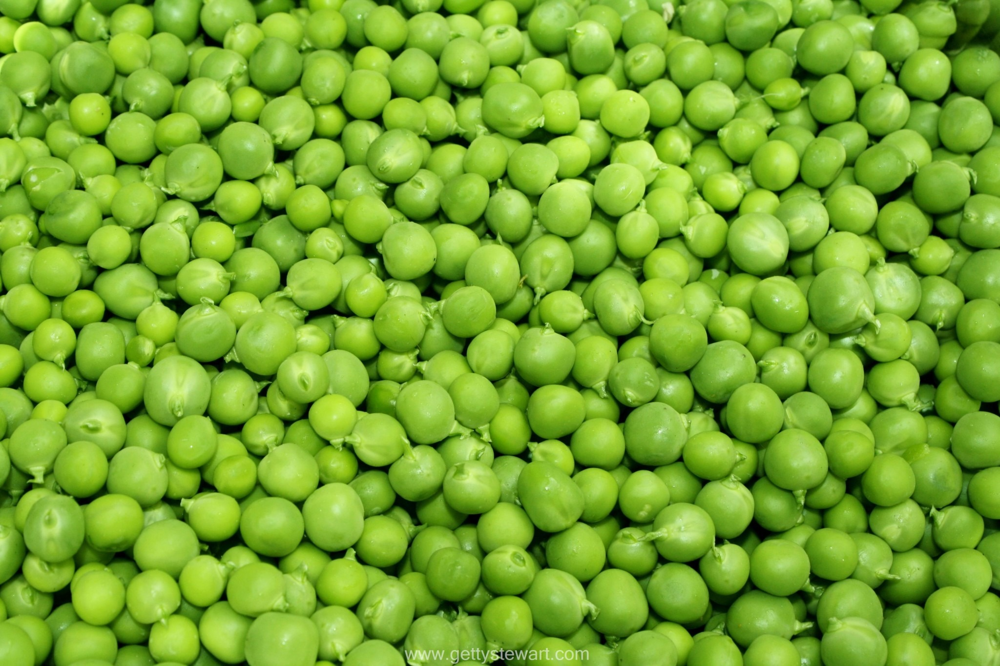

---

### 9. Hyacinth Beans
**Scientific name:** *Lablab purpureus*
A multipurpose legume with attractive purple or white flowers and flat pods. Used as food, animal feed, and ornamental plant. Originally native to Africa and widely spread across Asia.

> 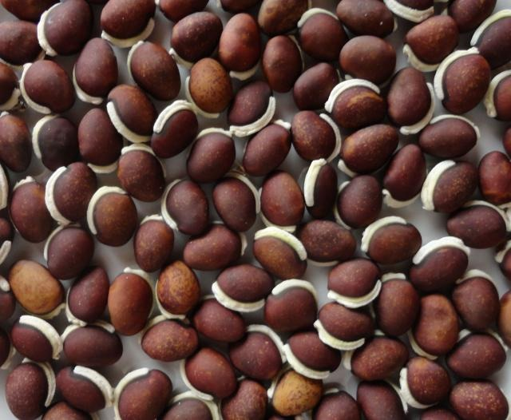

---

### 10. Kidney Beans
**Scientific name:** *Phaseolus vulgaris*
Dark red, kidney-shaped beans that are a staple in many cuisines including Indian, American, and Mexican. High in protein and fiber. The plant is a climbing variety of the common bean.

> 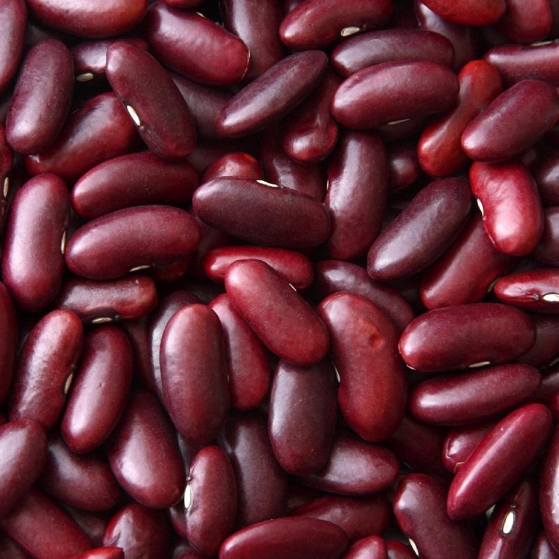

---

### 11. Lentils
**Scientific name:** *Lens culinaris*
Small, lens-shaped seeds that come in various colors: green, brown, red, and black. One of the world's oldest cultivated legumes, widely used in soups and stews. The plant is a bushy annual.

> 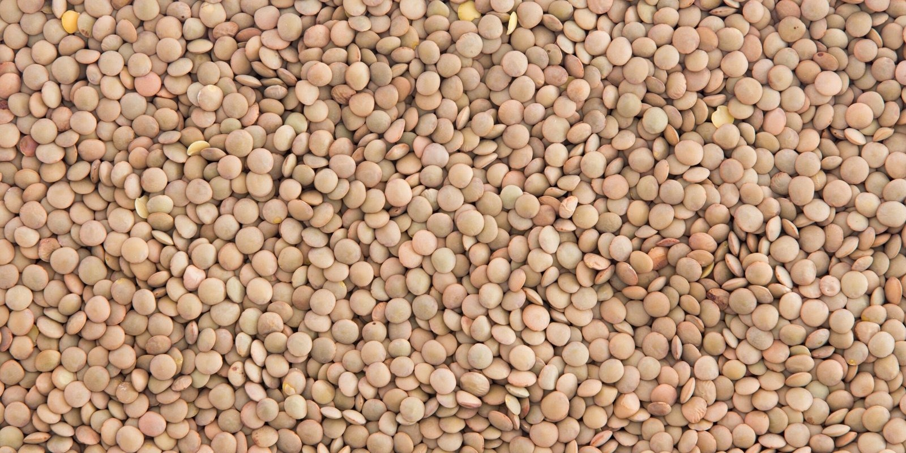

---

### 12. Lima Beans
**Scientific name:** *Phaseolus lunatus*
Large, flat beans with a mild, creamy flavor. Also called butter beans. Native to Central America, now cultivated worldwide. The seeds can be white, green, red, or purple.

> 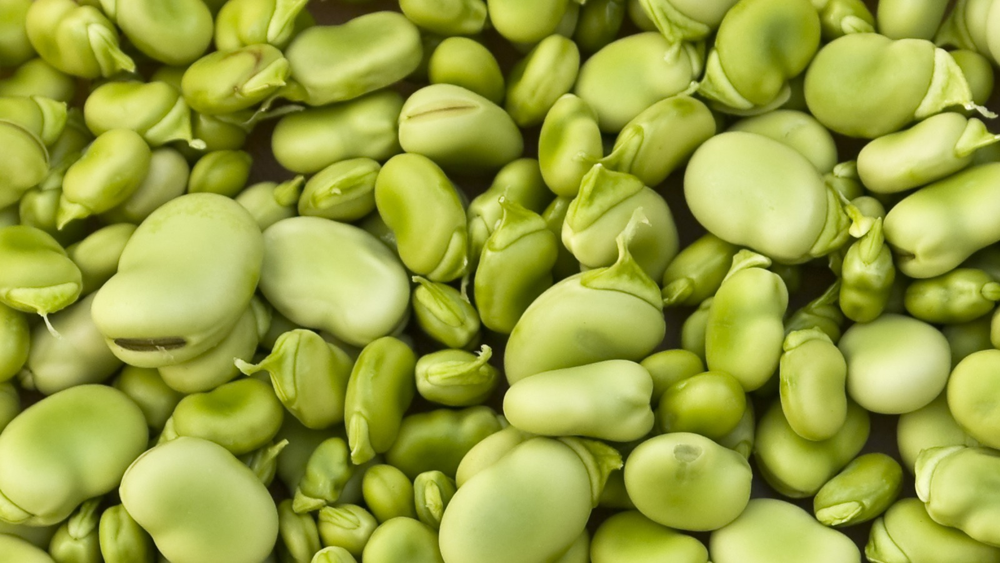

---

### 13. Mung Beans
**Scientific name:** *Vigna radiata*
Small, round, green-colored beans widely grown and consumed across Asia. Commonly sprouted and used in soups, curries, and desserts. The plant is short and bushy with yellow flowers.

> 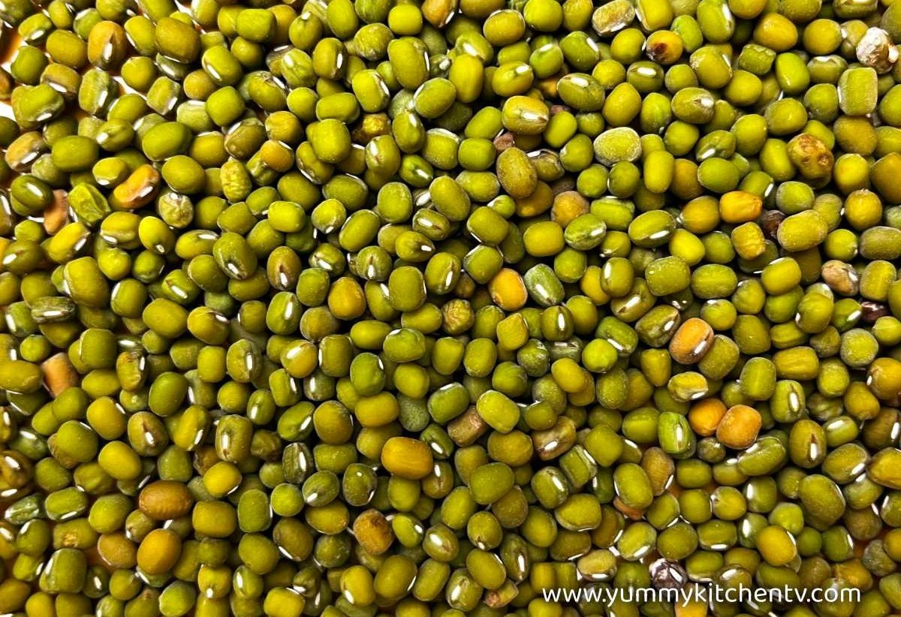

---

### 14. Navy Beans
**Scientific name:** *Phaseolus vulgaris*
Small, oval, white beans named for their use as a staple food in the U.S. Navy in the early 20th century. Commonly used in baked beans and soups. Mild in flavor and high in fiber.

> 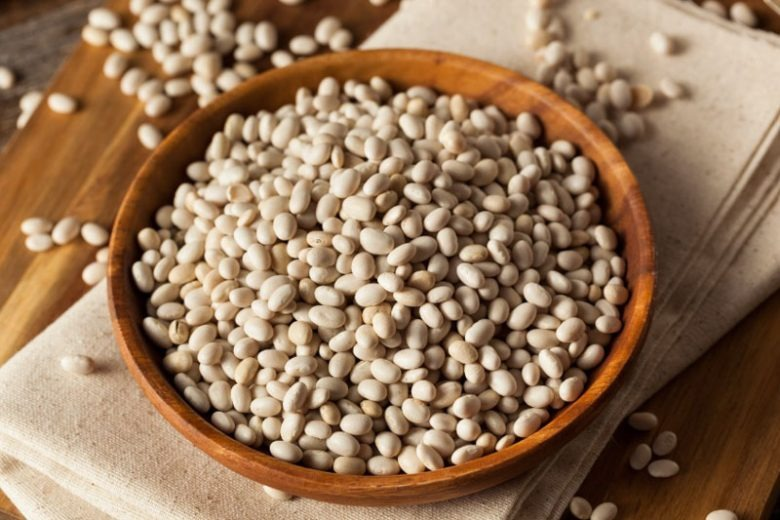

---

### 15. Peanuts (Arachis)
**Scientific name:** *Arachis hypogaea*
Technically a legume, not a nut, that develops its pods underground after flowering. Widely grown in tropical and subtropical regions. Used for oil, butter, and as a direct food source.

> 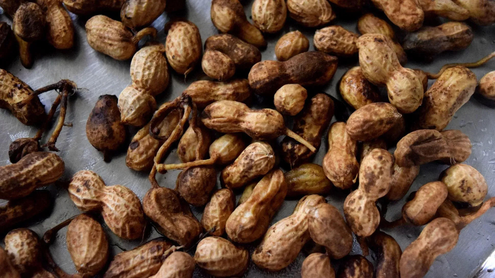

---

### 16. Pigeon Peas
**Scientific name:** *Cajanus cajan*
A perennial legume shrub native to South Asia and widely grown in Africa and the Caribbean. Seeds are used in dals, stews, and rice dishes. The plant is drought-tolerant and improves soil nitrogen.

> 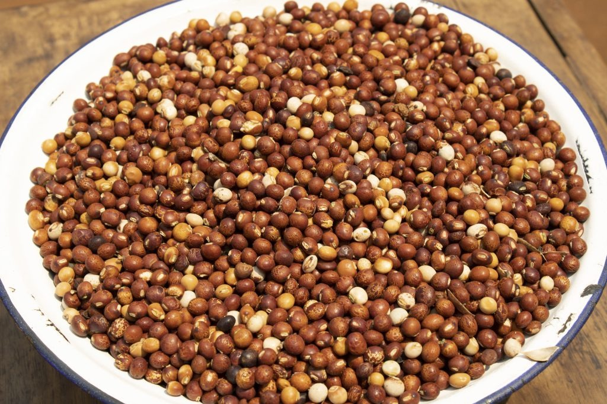

---

### 17. Pinto Beans
**Scientific name:** *Phaseolus vulgaris*
Mottled beige-and-brown beans that turn solid pink when cooked. A staple in Mexican and Southwestern U.S. cuisine. The plant is a bush-type bean that grows in warm climates.

> 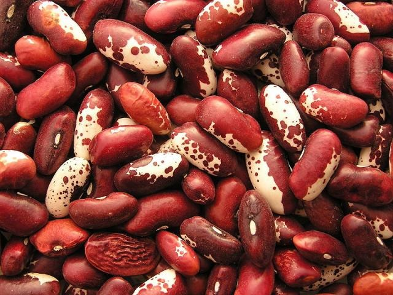

---

### 18. Soybeans (Glycine)
**Scientific name:** *Glycine max*
One of the most economically important legumes in the world. Used for oil, tofu, soy milk, and animal feed. The plant grows as an erect bushy annual with small white or purple flowers.

> 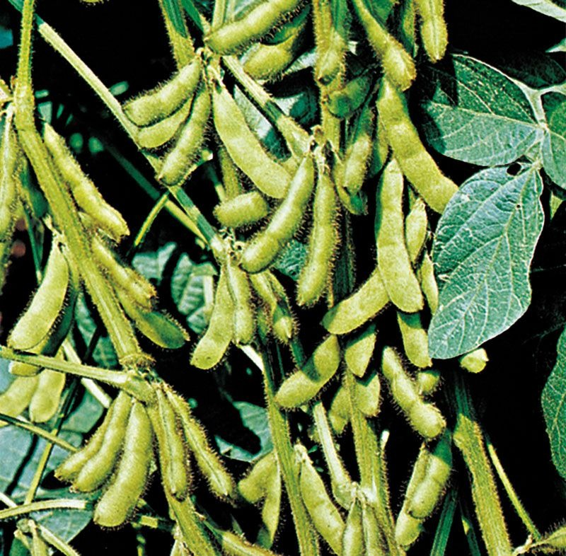

---

### 19. Split Peas
**Scientific name:** *Pisum sativum var. arvense*
Dried and split seeds of the field pea. Available in green and yellow varieties. Commonly used in soups. They are a good source of plant protein, fiber, and vitamins.

> 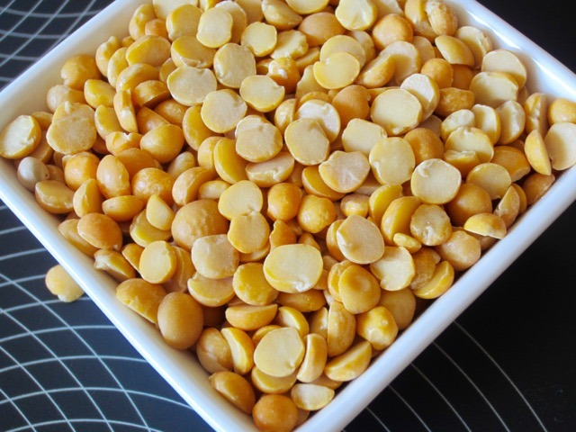

---

### 20. Winged Beans
**Scientific name:** *Psophocarpus tetragonolobus*
A tropical legume with distinctive four-winged pods. Almost every part of the plant is edible — pods, seeds, leaves, flowers, and tuberous roots. Native to Papua New Guinea and Southeast Asia.

> 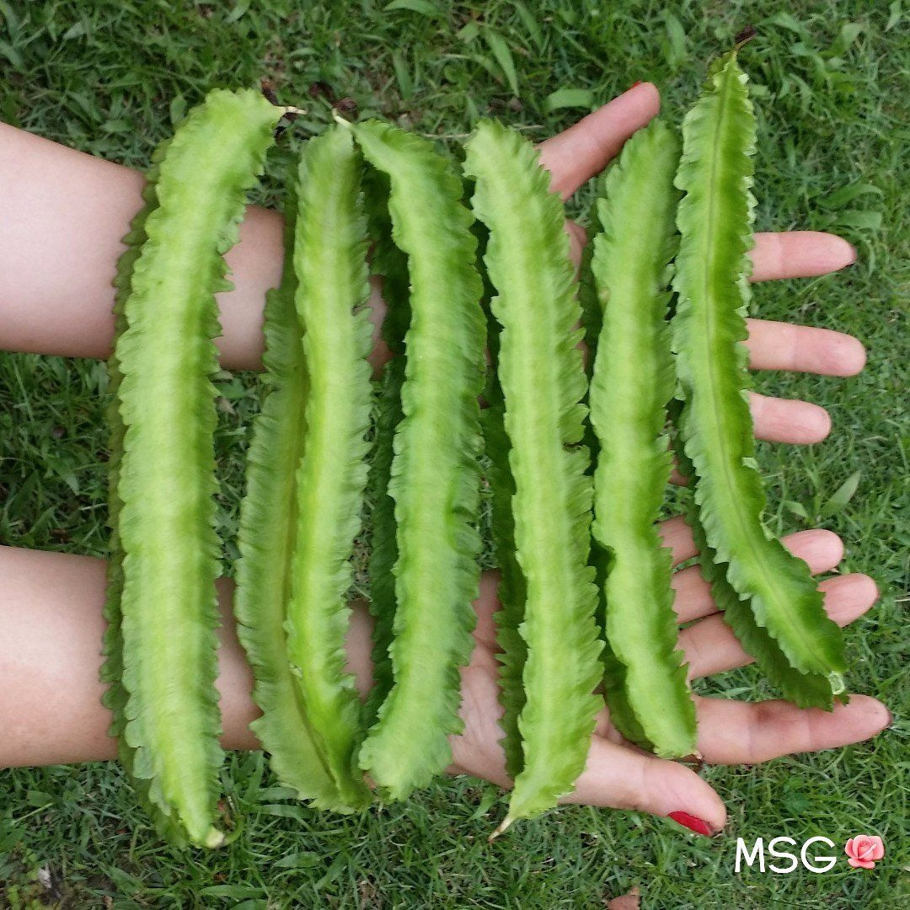

---

## C. Model Training Details

The model was trained using **Google Teachable Machine** (Standard Image Model) with the following parameters:

| Parameter | Value |
|-----------|-------|
| **Epochs** | 50 |
| **Batch Size** | 16 |
| **Learning Rate** | 0.001 |
| **Images per Class** | 250 |
| **Total Classes** | 20 |
| **Total Images** | 5,000 |

### Why These Values Were Chosen

- **Epochs (50):** 50 epochs was chosen as a starting point to allow the model enough passes through the dataset to learn distinguishing features between 20 visually similar legume classes without overfitting.
- **Batch Size (16):** A smaller batch size of 16 was used to allow more frequent weight updates during training, which helps the model generalize better especially with visually complex datasets.
- **Learning Rate (0.001):** The default learning rate of 0.001 was used as it is a well-established starting value. It is small enough to avoid overshooting minima but sufficient to allow steady convergence.

> 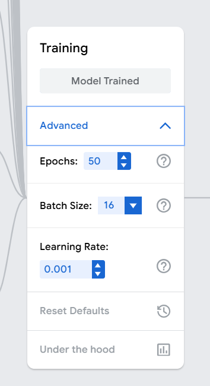

---

## D. Model Evaluation

### Accuracy Per Class

The table below shows the per-class accuracy results from the **"Under the Hood"** section in Teachable Machine. Each class had **38 test samples**.

| Class | Accuracy | # Samples |
|-------|----------|-----------|
| Adzuki Beans | 0.92 | 38 |
| Bambara Groundnuts | 0.87 | 38 |
| Black Beans | 0.66 | 38 |
| Black-eyed Peas | 0.95 | 38 |
| Chickpeas Garbanzo | 0.89 | 38 |
| Cowpeas Vigna | 0.61 | 38 |
| Fava Beans | 0.89 | 38 |
| Green Peas | 0.97 | 38 |
| Hyacinth Beans | 0.89 | 38 |
| Kidney Beans | 0.92 | 38 |
| Lentils Lens | 0.89 | 38 |
| Lima Beans | 0.74 | 38 |
| Mung Beans | 0.82 | 38 |
| Navy Beans | 0.74 | 38 |
| Peanuts Arachis | 0.84 | 38 |
| Pigeon Peas | 0.71 | 38 |
| Pinto Beans | 0.50 | 38 |
| Soybeans Glycine | 0.61 | 38 |
| Split Peas | 0.76 | 38 |
| Winged Beans | 0.84 | 38 |

**Overall Model Accuracy: ~0.80 (80%)**

> 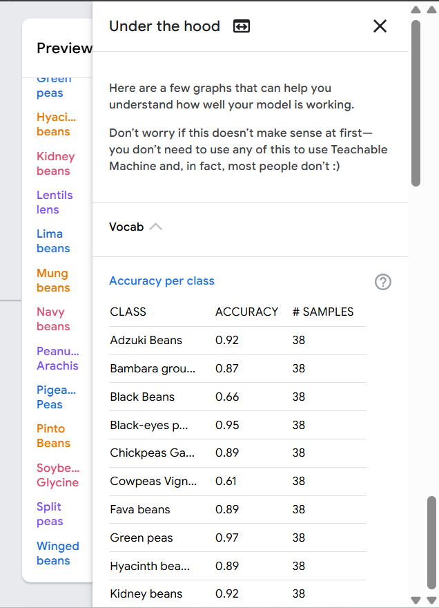

---

### Confusion Matrix

The confusion matrix visualizes the model's correct and incorrect predictions for each class. Darker blue cells along the diagonal represent correct classifications.

> 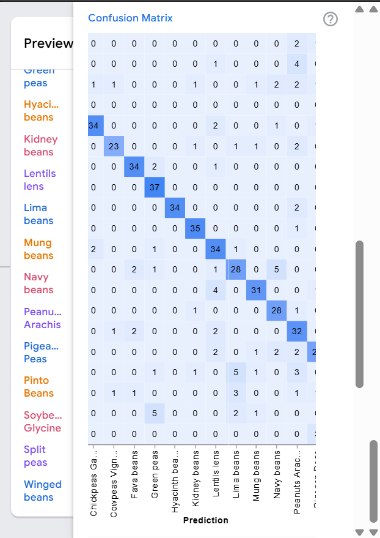
> > 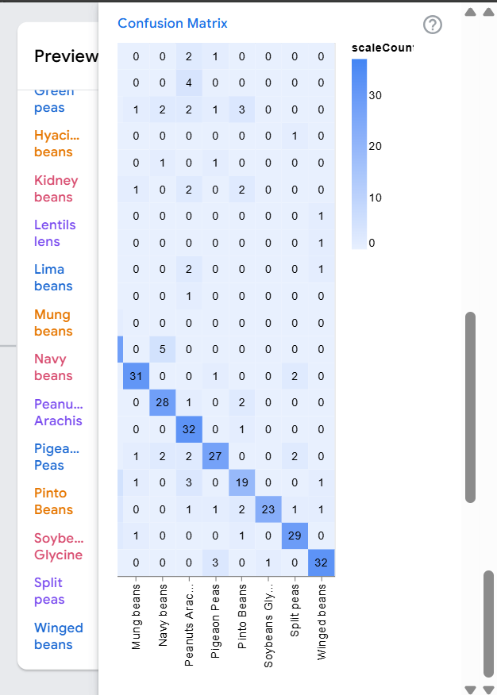

**Key observations from the Confusion Matrix:**
- **Green Peas** and **Black-eyed Peas** had the fewest misclassifications.
- **Pinto Beans** and **Cowpeas** showed the most confusion with other similar-looking classes.
- **Black Beans** were sometimes confused with other dark-colored beans such as Pinto Beans.

---

## E. Model Testing

Below are 10 test results from the **Preview section** of Teachable Machine, showing the input image, predicted class, and confidence score.

---

### Test 1 — Adzuki Beans
- **Predicted:** Adzuki Beans
- **Confidence:** 98%
- **Result:** ✅ Correct

> 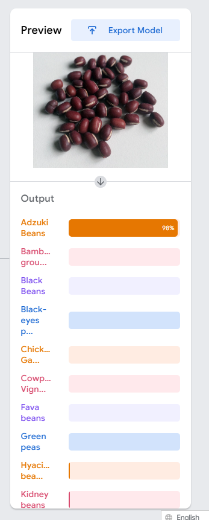

---

### Test 2 — Bambara Groundnuts
- **Predicted:** Bambara Groundnuts
- **Confidence:** 93%
- **Result:** ✅ Correct

> 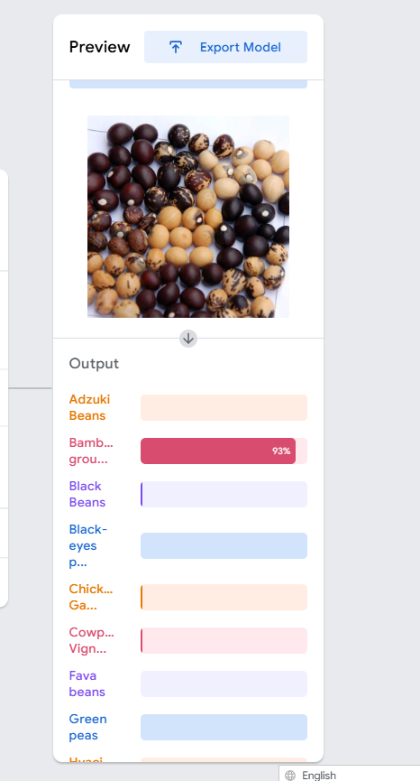

---

### Test 3 — Black Beans
- **Predicted:** Black Beans
- **Confidence:** 71%
- **Result:** ✅ Correct

> 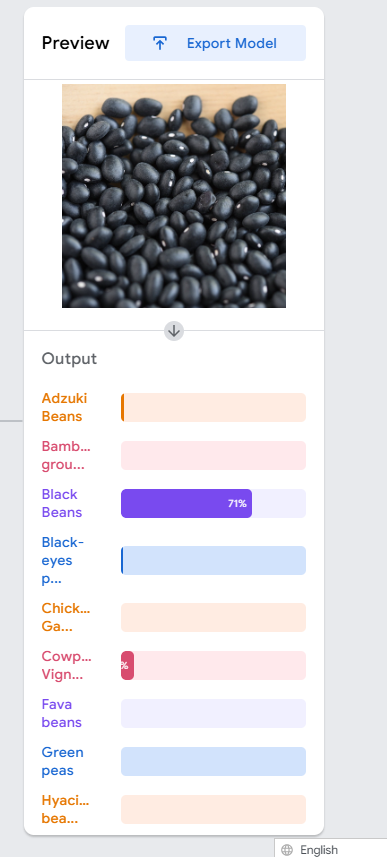

---

### Test 4 — Black-eyed Peas
- **Predicted:** Black-eyed Peas
- **Confidence:** 63%
- **Result:** ✅ Correct

> 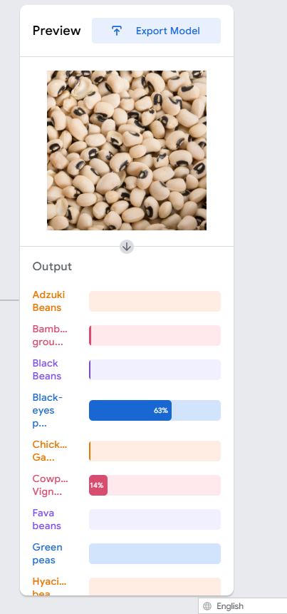

---

### Test 5 — Chickpeas (Garbanzo)
- **Predicted:** Chickpeas Garbanzo
- **Confidence:** 74%
- **Result:** ✅ Correct

> 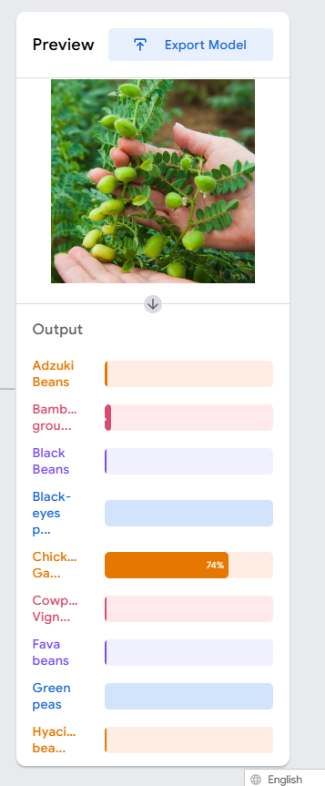

---

### Test 6 — Cowpeas (Vigna)
- **Predicted:** Cowpeas Vigna
- **Confidence:** 56%
- **Result:** ✅ Correct

> 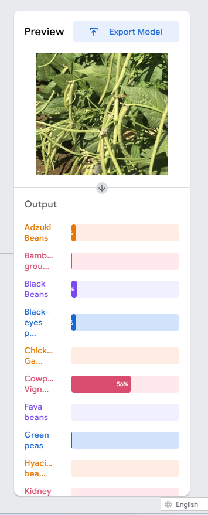

---

### Test 7 — Fava Beans
- **Predicted:** Fava Beans
- **Confidence:** 58%
- **Result:** ✅ Correct

> 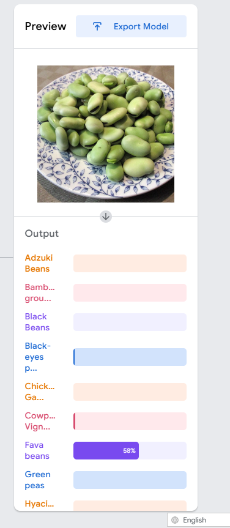

---

### Test 8 — Green Peas
- **Predicted:** Green Peas
- **Confidence:** 90%
- **Result:** ✅ Correct

> 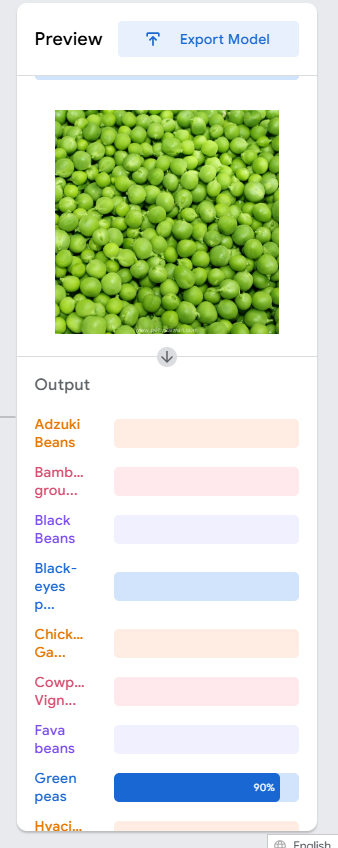

---

### Test 9 — Hyacinth Beans
- **Predicted:** Hyacinth Beans
- **Confidence:** 61%
- **Result:** ✅ Correct

> 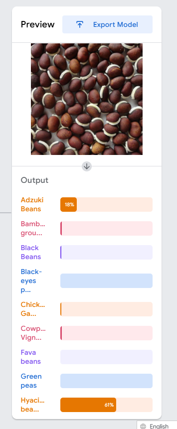

---

### Test 10 — Kidney Beans
- **Predicted:** Kidney Beans
- **Confidence:** 94%
- **Result:** ✅ Correct

> 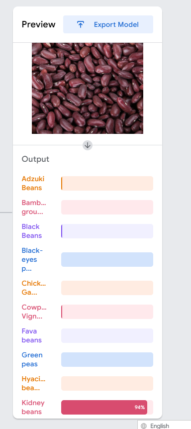

---

## F. Reflection Questions

### 1. How did the number of images per class affect your model's accuracy?

Having 250 images per class provided a reasonably large and balanced dataset, which helped the model learn distinguishing features without being biased toward any single class. A uniform distribution of 250 images across all 20 classes ensured that no species was over- or under-represented during training. However, some classes with more visual variation — such as Pinto Beans and Cowpeas — still underperformed, suggesting that image diversity (not just quantity) also plays a critical role. Increasing the number of images, especially for lower-accuracy classes, would likely improve overall model performance.

---

### 2. Which plant species were most commonly misclassified and why?

The most commonly misclassified species were:
- **Pinto Beans (0.50)** — often confused with other similarly colored or mottled beans like Kidney Beans.
- **Cowpeas Vigna (0.61)** — visually similar to Black-eyed Peas and other light-colored small legumes.
- **Soybeans Glycine (0.61)** — pods and seeds resemble other green or brown legumes.
- **Black Beans (0.66)** — the dark uniform color is shared with other dark-seeded legumes.

These misclassifications likely occurred because the species share similar color profiles, seed shapes, and sizes. The model may also have been confused by the wide variety of image types used (seeds vs. whole plants vs. pods), which introduced visual inconsistency within a class.

---

### 3. How did changing the epochs, batch size, or learning rate affect the training results?

In the second training run, the parameters were adjusted to **60 epochs, batch size 32, and learning rate 0.00105**. Increasing the batch size from 16 to 32 allowed the model to process more samples per update, making training faster but slightly less sensitive to individual variations. Slightly increasing the learning rate (from 0.001 to 0.00105) sped up convergence. Increasing epochs from 50 to 60 gave the model more time to refine its weights. These adjustments produced broadly similar results, suggesting the model had already approached a performance ceiling with the current dataset quality and that further improvement would require better image curation rather than hyperparameter tuning alone.

---

### 4. What challenges did you encounter during dataset collection and labeling?

- **Visual similarity:** Many legume species look nearly identical at certain growth stages or when viewed as dried seeds, making it difficult to ensure label accuracy.
- **Image diversity:** Finding 250 high-quality, non-duplicate images per class was challenging. Some classes had limited online image availability, requiring the collection of plant images (flowers, pods, fields) rather than just seed images.
- **Inconsistent image types:** Some classes had mostly seed images while others had more field/plant photos, creating inconsistency in the visual features the model learned from.
- **Watermarks and low quality:** Many online images contained watermarks or were low resolution, which had to be filtered out to maintain dataset quality.

---

### 5. If you were to improve your model, what specific changes would you make and why?

1. **Standardize image types per class** — Use only one consistent image type per class (e.g., always seeds on white background), which would reduce visual noise and help the model focus on distinguishing features.
2. **Increase dataset size for weak classes** — For classes like Pinto Beans (0.50) and Cowpeas (0.61), collecting 400–500 images and including more diverse angles would improve accuracy.
3. **Data augmentation** — Apply flipping, rotation, brightness adjustment, and zoom to artificially expand the dataset and improve generalization.
4. **Increase training epochs** — Training for 100+ epochs with early stopping to prevent overfitting may yield better results.
5. **Use a more advanced model** — Migrating to a custom CNN (e.g., MobileNetV2 via TensorFlow) with fine-tuning would allow greater control over architecture and likely achieve higher accuracy.

---

## G. Model Export

Saved Model: [(https://drive.google.com/file/d/1Zs-ObUAO6C8UpnOHZ6uzCFS4vykA-gEU/view?usp=sharing)]

---

*Laboratory Work 2-A | Plant Species Image Classification | Google Teachable Machine*
